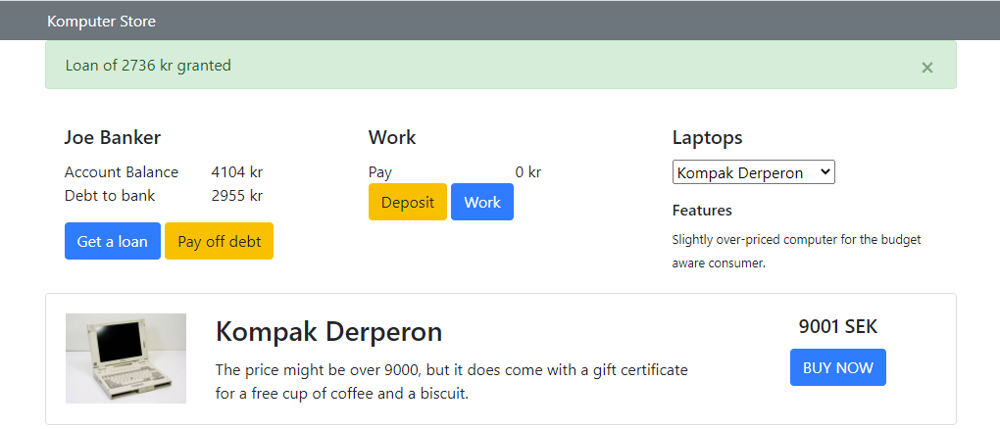

# Experis-Komputer-Store
This application is built in basic javascript, bootstrap, html and css. Task as per [instructions](Instructions.pdf).

# How to use
Click the work button to 'work' and get paid. Transfer these funds to your bank account by clicking the 'Deposit' button.

You can borrow money from the bank up to a maximum of twice your bank balance, as long as you don't have any outstanding debt already.

Select a laptop from the dropdown on the right to bring out a description of the item.
You can purchase the item if you have sufficient funds in your bank account. 

# Requirements to run
* A web development server
* A modern web browser

# How to run
Run your favourite dev server, e.g. liveserver in vscode.
Open index.html in your browser through the port exposed by the web server
